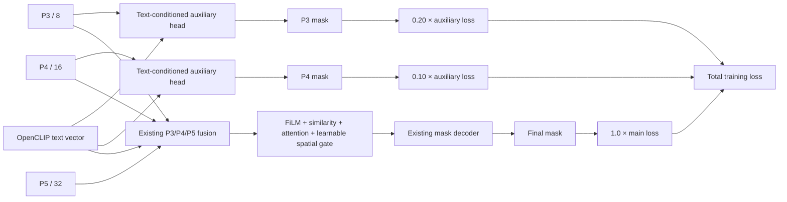

# HFSA Architecture

This document records the current architecture facts needed to continue the HFSA semantic segmentation branch. `PROJECT_RULES.md` remains the single source of truth for development rules.

## Project Boundary

HFSA targets multimodal remote-sensing interpretation. The current personal branch focuses on text-guided referring semantic segmentation on RRSIS-D:

- Input: one remote-sensing image and one free-text referring expression.
- Output: one binary mask for the referred target.
- Main training entry: `HFSA-main/train_semseg.py`.
- Dataset adapter: `HFSA-main/dataset/rrsisd_refseg_dataset.py`.
- Main model config: `HFSA-main/ultralytics/cfg/models/v12/yolov12-semseg.yaml`.

The project baseline and core YOLO/OpenCLIP code were mostly completed by the senior teammate. This branch should not modify backbone, neck, OpenCLIP encoder, or general Ultralytics internals unless explicitly reviewed and approved.

## Core Modules

- Data layer: parses RRSIS-D referring segmentation metadata, reads images, decodes binary masks, loads cached text embeddings, and applies train-only lightweight augmentation.
- Text embedding layer: uses cached OpenCLIP text vectors, currently expected to match `text_dim=768`.
- Model layer: uses YOLOv12 backbone/neck with a text-guided segmentation head through `TextPromptSegment`.
- Training layer: `train_semseg.py` builds datasets, samplers, model, loss, metrics, checkpoints, plots, and run artifacts.
- Experiment artifacts: `HFSA-main/runs/` stores training results and should not be treated as source code.

## Dependency Direction

Allowed:

- `train_semseg.py` depends on dataset adapters, model config, Ultralytics model construction, and cached text embeddings.
- Dataset adapters depend on standard libraries, NumPy, PyTorch, OpenCV/Pillow fallback, and metadata files.
- The segmentation branch may add training options, sampling policy, metrics, and segmentation-head integration logic.

Restricted:

- Dataset code must not depend on trainer state.
- Model code must not hard-code local dataset paths.
- Validation must not mutate training or dataset construction policy.
- Backbone/neck/OpenCLIP changes require explicit architecture review.

## Current Semantic Segmentation Training Policy

- Mainline model config is non-P2: `yolov12-semseg.yaml`.
- P2 config remains an experimental alternative, not the default mainline.
- Small-target sampling boost default is `2.0`, reduced from the previously recommended `3.0` to avoid over-amplifying small-object samples.
- Small-target sampling uses true foreground mask area from RLE metadata when available, with bbox area only as a fallback.
- Binary segmentation loss is computed per sample before averaging, with optional area-aware loss weighting for very small masks.
- Train-time augmentation is lightweight and only enabled for the training split:
  - horizontal flip only when the text has no directional/positional words
  - vertical flip only when the text has no directional/positional words
  - brightness/contrast jitter
- Rotation is intentionally not included because RRSIS-D text may include directional expressions such as left, right, top, or bottom. For the same reason, geometric flip is automatically skipped for samples whose text contains directional/positional words.

## Known Risks

- Validation loss and IoU can diverge because BCE/Dice-style losses and thresholded mask IoU optimize different surfaces.
- RRSIS-D weak classes observed in recent experiments include vehicle, harbor, windmill, and tenniscourt.
- Text-guided spatial relationships remain a hard case because global text vectors have limited token-level grounding.
- `train_semseg.py` still concentrates many responsibilities and should be split only after the current experimental baseline is stable.
- Git repository state is currently abnormal: `git status` reports that the current root is not recognized as a Git repository despite `.git` directories being present.

## Recent Architecture Decision Status

ADR-0004 standardizes the RRSIS-D evaluation protocol while retaining legacy result fields for historical compatibility.

## RRSIS-D Evaluation Protocol

The semantic segmentation entry now distinguishes the published RRSIS-D metrics from internal diagnostics:

- `oiou`: cumulative foreground intersection divided by cumulative foreground union across the split. Historical `target_iou` is equivalent.
- `official_miou`: mean of per-sample foreground IoUs. Historical `sample_miou` is equivalent.
- `Pr@0.5` through `Pr@0.9`: fraction of samples whose foreground IoU reaches the corresponding threshold.
- `class_miou`: per-category mean of sample IoUs, grouped by `class_idx`.
- `class_oiou`: per-category cumulative foreground IoU. Historical `class_iou` is equivalent and is not the paper per-category mIoU.

Validation may select a checkpoint by oIoU or official mIoU. Optional test evaluation loads the best validation checkpoint and reuses its frozen validation-selected mask threshold. It does not scan thresholds on the test split. See ADR-0004.

## Experimental P3/P4 Deep Supervision

ADR-0005 adds a controlled, training-only deep-supervision candidate to the FPN-style `TextPromptSegment`:

The auxiliary masks use the same BCE-Tversky objective as the final mask. Their targets are foreground-preserving downsampled masks. P5 has no auxiliary loss in the first experiment. Auxiliary outputs are disabled during validation and inference, so the official evaluation interface continues to receive only the final mask logits.
